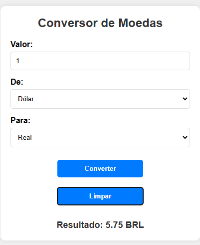

# Conversor de moedas API
 
## Introdução
Este projeto é uma aplicação web para conversão de moedas em tempo real, desenvolvida com HTML5, CSS3 e JavaScript puro. Seu principal objetivo é permitir ao usuário converter valores entre diferentes moedas, usando cotações atualizadas através de uma integração com uma API de câmbio. Com essa API, a aplicação acessa as taxas de conversão em tempo real, refletindo as variações do mercado e proporcionando resultados precisos para o usuário.
 
Este projeto é uma evolução de um trabalho anterior e foca em melhorar a precisão e a funcionalidade do sistema de conversão, garantindo atualizações dinâmicas das taxas de câmbio e uma interface intuitiva para o usuário final.
 

 
## Funcionalidades
 
- const apiKey = `2a6a2e538b7cb0af0947db4a`;
- const apiURL = `https://v6.exchangerate-api.com/v6/${apikey}/latest/`;
 
Aqui, configuramos a chave da API (apiKey) e a URL base da API de câmbio (apiURL). A chave é necessária para acessar os dados e a URL define o endereço principal para as requisições de câmbio.

 
- async function getExchangeRate(daMoeda, paraMoeda) {
    try {
        const response = await fetch(`${apiURL}${daMoeda}`);
        const data = await response.json();
 
A função getExchangeRate é responsável por buscar a taxa de câmbio entre duas moedas. Ela usa fetch() para requisitar os dados da API e converte a resposta para JSON.

 
 
- if (data.result === "success") {
            return data.conversion_rates[paraMoeda];
        } else {
            throw new Error("Erro ao buscar as taxas de câmbio");
        }
    } catch (error) {
        console.error("Erro:", error);
        return null;
    }
}
 
Depois de obter os dados da API, o código verifica se a resposta foi bem-sucedida (data.result === "success"). Se sim, retorna a taxa de câmbio para a moeda de destino; se não, exibe um erro no console e retorna null.

 
- document.getElementById('currency-form').addEventListener('submit', async function(event) {
    event.preventDefault();
 
Aqui, o código configura um evento de submit no formulário currency-form. O event.preventDefault() impede que a página seja recarregada ao enviar o formulário.

 
- const valor = parseFloat(document.getElementById('amount').value);
    const daMoeda = document.getElementById('daMoeda').value;
    const paraMoeda = document.getElementById('paraMoeda').value;
 
Essas linhas capturam o valor digitado para conversão (amount), a moeda de origem (daMoeda) e a moeda de destino (paraMoeda). parseFloat() converte o valor inserido para um número decimal.

 
- const exchangeRate = await getExchangeRate(daMoeda, paraMoeda);
 
Aqui, o código chama a função getExchangeRate para obter a taxa de câmbio atual entre as moedas selecionadas. Com await, ele aguarda o retorno da função antes de continuar.

 
- if (exchangeRate) {
        const convertedValue = valor * exchangeRate;
        const conversao = document.getElementById('result');
        conversao.textContent = `Resultado: ${convertedValue.toFixed(2)} ${paraMoeda}`;
    } else {
        alert("Erro ao buscar a cotação. Tente novamente.");
    }
});
 
Se a taxa de câmbio foi obtida, o código calcula o valor convertido e exibe o resultado na tela. Se houve algum erro na obtenção da taxa, uma mensagem de alerta é mostrada ao usuário.

 
## Fontes consultadas
- API de câmbio:
 
Para obter as taxas de conversão, a aplicação usa uma API de câmbio, como ExchangeRate-API (ou similar). A API fornece as cotações atualizadas de diferentes moedas, e, para acessá-la, foi necessário obter uma chave de API (API Key), que é utilizada nas requisições para garantir que o acesso seja autorizado. A aplicação realiza essas requisições usando o método fetch() para buscar os dados de conversão em tempo real.
 
## Tecnologias utilizadas:
- Visual Studio Code
 - Github
 - Git
 - HTML5
 - CSS3
 - Javascript
 
  ## Autores:
- [Nicolas Tonassi](https://github.com/nicolas-tonassi)
- [Naillim Novaski](https://github.com/naillimnovaski)
